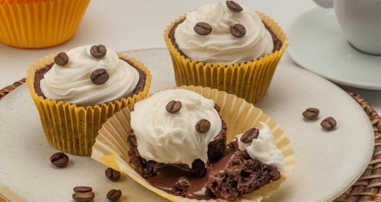

# 📋 Página de Receita: Cupcake de Café com Chantilly

**Projeto desenvolvido com HTML e CSS durante o curso FullStack.**

## 🌟 Sobre o Projeto

Esta é uma página estática que apresenta uma deliciosa receita de **Cupcake de Café com Chantilly**, ideal para quem ama café e quer experimentar algo diferente. O projeto explora conceitos básicos de estruturação de páginas web, estilização com CSS e uso de fontes do Google Fonts.



---

## 🚀 Tecnologias Utilizadas

- **HTML5**
- **CSS3**
- **Google Fonts**

---

## 🖼️ Demonstração

- **Tempo de preparo:** 1h10  
- **Porções:** 12  
- **Dificuldade:** Fácil  

Acesse a receita completa na página! Aqui estão os detalhes principais:
1. Ingredientes bem organizados.
2. Modo de preparo explicado em passos fáceis.
3. Layout limpo e responsivo.

---

## 🛠️ Como Executar o Projeto

1. Clone o repositório:
   ```bash
   git clone https://github.com/CiceroEduardo84/Recipe_Page.git
